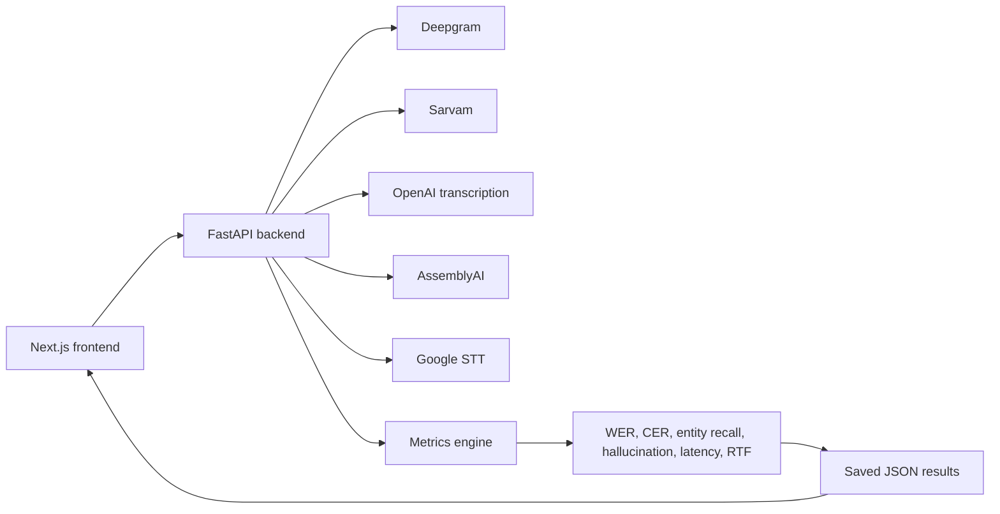

# VahanAI ASR Benchmark

This is my ASR benchmarking submission for Indian conversational speech.

The app compares Deepgram against Sarvam, OpenAI, AssemblyAI, and Google Speech-to-Text on real audio samples. The public page shows the completed benchmark. The playground lets someone upload or record audio, add ground truth, and run models live.

Live playground access is protected because paid or limited API keys are hosted on the backend. Deepgram Nova-3 stays open for everyone.


## What I Built

| Area | Details |
|---|---|
| Results page | Saved benchmark table, charts, transcript evidence, and metric explanations |
| Upload playground | Upload file, record in browser, add ground truth, select models, and run live ASR |
| Public access | Deepgram Nova-3 can be used without a password |
| Judge access | Paid models unlock with a backend password |
| Providers | Deepgram, Sarvam, OpenAI, AssemblyAI, Google STT |
| Dataset | 32 labelled voice notes with language, condition, entity, and ground truth |

## Architecture



The frontend never stores provider API keys. Keys stay in backend environment variables.

## Security Model

Deepgram Nova-3 is open so anyone can try the playground.

Paid models are locked:

| User | What they can do |
|---|---|
| Public visitor | Run Deepgram Nova-3 only |
| Judge | Enter password once and unlock paid models |
| Direct API caller | Backend rejects paid models without the password header |

Required backend env:

```env
PLAYGROUND_PASSWORD=...
DEEPGRAM_API_KEY=...
SARVAM_API_KEY=...
ASSEMBLYAI_API_KEY=...
OPENAI_API_KEY=...
GOOGLE_SERVICE_ACCOUNT_JSON_B64=...
```

`backend/.env` is ignored by Git.

## Models Benchmarked

| Provider | Models |
|---|---|
| Deepgram | Nova-3, Nova-2, Base |
| Sarvam | Saarika v2.5, Saaras v3, Saaras v3 Codemix |
| OpenAI | GPT-4o Transcribe, GPT-4o Mini Transcribe |
| AssemblyAI | Best |
| Google STT | Latest Long, Telephony |

## Metrics

| Metric | Why I used it |
|---|---|
| WER | Broad word-level transcription accuracy |
| CER | Useful for spelling drift in names and locality words |
| Accuracy | `1 - WER`, easier to read for non-technical reviewers |
| Entity recall | Checks whether important names and places were captured |
| Entity F1 | Balances entity precision and recall |
| Hallucination rate | Tracks inserted words that were not in the ground truth |
| Latency | Matters for interactive voice workflows |
| Real-time factor | Processing time divided by audio duration. Below 1x is faster than real time |
| Failure count | Captures API limits and operational reliability |

WER is not always the full story. If a model gives a correct translation, transliteration, or another valid script, WER can make it look worse than it is. That is why the app also shows ground truth and model output side by side.

## Current Benchmark

The saved benchmark uses `data/Voice Notes.xlsx`.

| Detail | Value |
|---|---|
| Recordings | 32 |
| Audio source | Cloud-hosted OGG files |
| Labels | Ground truth, language, condition, entity |
| Output files | `data/results/*` and `frontend/public/benchmark-results.json` |

Top results by WER:

| Rank | Model | WER | Accuracy | Entity Recall | Hallucination | RTF | Failures |
|---:|---|---:|---:|---:|---:|---:|---:|
| 1 | Sarvam Saarika v2.5 | 16.44% | 83.56% | 76.67% | 2.83% | 0.172x | 2 |
| 2 | Sarvam Saaras v3 Codemix | 17.86% | 82.14% | 65.00% | 2.30% | 0.175x | 2 |
| 3 | OpenAI GPT-4o Mini Transcribe | 18.35% | 81.65% | 60.44% | 2.61% | 0.248x | 0 |
| 4 | Sarvam Saaras v3 | 18.69% | 81.31% | 65.00% | 2.67% | 0.183x | 2 |
| 5 | Deepgram Nova-3 | 24.16% | 75.84% | 35.66% | 4.24% | 0.334x | 0 |

My read:

Sarvam had the best accuracy and entity recall on short files, but its synchronous API failed on two files above 30 seconds. OpenAI GPT-4o Mini was the strongest zero-failure model. Deepgram Nova-3 was reliable and fast enough, but missed more locality entities in this dataset.

## Transcript Examples

| Ground truth | Model | Output | Result |
|---|---|---|---|
| Electronic City feels like a different town altogether | Deepgram Nova-3 | Electronic City feels like a different town altogether. | Exact match after normalization |
| Electronic City feels like a different town altogether | Sarvam Saarika v2.5 | Electronic city feels like a different town altogether. | Correct locality |
| We move to Sarjapur to be closer to the international schools | Sarvam Saarika v2.5 | We move to Sarjapur to be closer to the international schools. | Exact match after punctuation |
| I live in Koramangala | Sarvam Saarika v2.5 | I live in Koramangala. | Correct entity |
| We move to Sarjapur to be closer to the international schools | Deepgram Nova-3 | We moved to Sarjapur to be closer to the international schools. | Meaning is right, WER penalizes tense |

## How To Run

Backend:

```powershell
cd backend
python -m venv .venv
.\.venv\Scripts\Activate.ps1
pip install -r requirements.txt
uvicorn app.main:app --reload --host 127.0.0.1 --port 8000
```

Frontend:

```powershell
cd frontend
npm install
npm run dev
```

Frontend env:

```env
NEXT_PUBLIC_API_BASE_URL=http://localhost:8000
NEXT_PUBLIC_API_ROUTE_PREFIX=
```

## Re-run The Benchmark

```powershell
cd backend
.\.venv\Scripts\Activate.ps1
python scripts\run_benchmark.py --manifest "..\data\Voice Notes.xlsx" --output ..\data\results --frontend-public ..\frontend\public
```

## Links

| Item | Link |
|---|---|
| App | https://vahan-ai-assignment.vercel.app |
| GitHub | https://github.com/Satharva2004/Vahan-AI-Assignment |
| LinkedIn | https://www.linkedin.com/in/atharvasawant |

## Limitations

| Limitation | Impact |
|---|---|
| 32 samples only | Good for assignment signal, not production-level proof |
| WER is lexical | Can punish semantically correct translations or tense changes |
| Provider normalization differs | Punctuation, casing, numerals, and scripts vary |
| Sarvam file length limit | Two long samples failed on synchronous API |
| Hosted keys are rate-sensitive | Paid models are password locked |

## Final Recommendation

For the current dataset, I would use Sarvam Saarika v2.5 when the audio is short and entity accuracy matters most.

For a more robust production fallback, I would keep OpenAI GPT-4o Mini Transcribe as the zero-failure challenger and Deepgram Nova-3 as the public baseline because it is stable and simple to expose.
